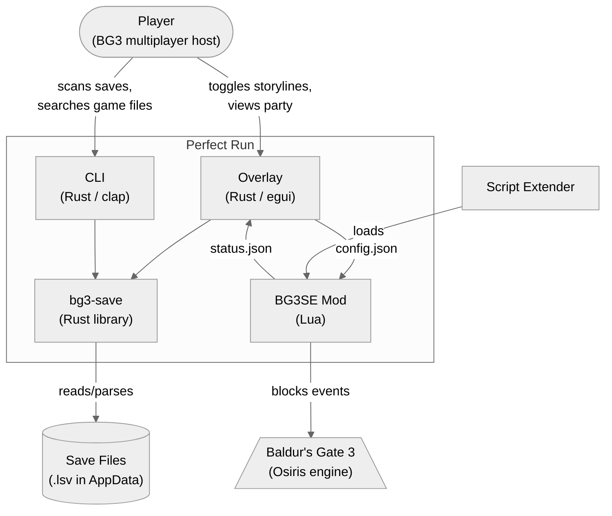
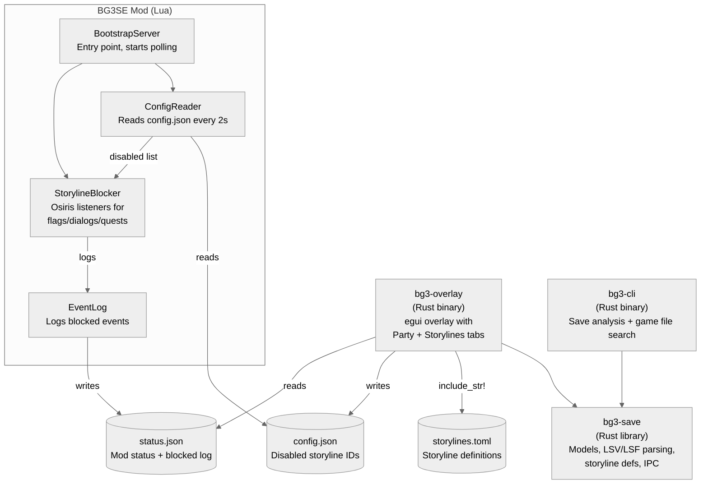
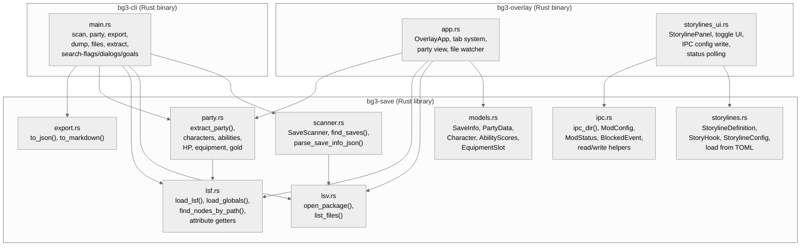
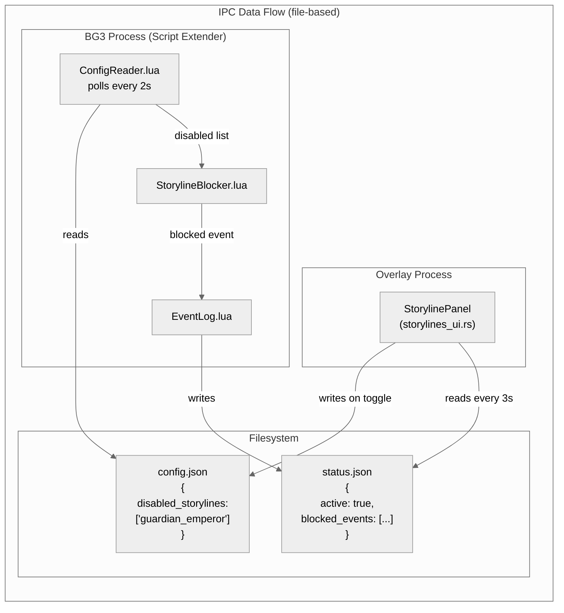

# Perfect Run

BG3 save file analyzer with an in-game overlay and a Script Extender mod for blocking storylines.

## Features

- **Save parser** — Extract party data, character stats, equipment from BG3 save files
- **CLI tool** — Scan saves, export party data as JSON/markdown, search unpacked game files
- **Overlay** — Real-time egui overlay showing party info, with auto-reload on save changes
- **Storyline toggle** — Disable entire storylines (Guardian/Emperor dreams, companion quests, etc.) via overlay toggles that control a BG3 Script Extender mod

## Architecture









## Development Setup (Windows 11)

### Prerequisites

1. **Rust** — Install from https://rustup.rs (default options are fine)

2. **Visual Studio Build Tools** — Required for compiling native dependencies (GLFW, zstd)
   - Download from https://visualstudio.microsoft.com/downloads/ (scroll to "Tools for Visual Studio", then "Build Tools for Visual Studio")
   - In the installer, select the **"Desktop development with C++"** workload
   - This installs: MSVC compiler (`cl.exe`), linker (`link.exe`), Windows SDK (`rc.exe`), `nmake`

3. **CMake** — Required for building GLFW
   - Download from https://cmake.org/download/ (Windows x64 installer)
   - During install, select "Add CMake to the system PATH"

4. **Git** — https://git-scm.com/download/win

### Clone and build

```bash
git clone <repo-url> perfect-run
cd perfect-run
build.bat build
```

Or from Git Bash:

```bash
cmd //c "build.bat build"
```

### What `build.bat` does

You **cannot** run `cargo build` directly because Git for Windows ships a `link.exe` (Unix utility) that shadows MSVC's `link.exe`, causing linker failures.

`build.bat` handles this by:
1. Using `vswhere.exe` to find your VS installation (works with any VS version/edition)
2. Calling `vcvarsall.bat x64` to set up the MSVC environment (PATH, LIB, INCLUDE)
3. Prepending the MSVC bin directory to PATH so MSVC's `link.exe` is found first
4. Setting `CMAKE_GENERATOR=NMake Makefiles` (the Visual Studio CMake generator doesn't work with Build Tools-only installs)
5. Running `cargo` with the correct environment

### Build commands

All commands go through `build.bat`:

```bash
build.bat build              # Debug build
build.bat build --release    # Release build
build.bat check              # Type-check without linking
build.bat check -p bg3-save  # Check a single crate
build.bat test               # Run tests
build.bat clippy             # Lint
```

## Project Structure

```
crates/
  bg3-save/       Core library (save parsing, storyline model, IPC types)
  bg3-cli/        CLI tool
  bg3-overlay/    egui in-game overlay
mod/
  PerfectRun/     BG3 Script Extender mod (Lua)
storylines.toml   Storyline definitions
build.bat         Build wrapper (sets up MSVC environment)
```

## Usage

### CLI

```bash
# List all saves
build.bat run -p bg3-cli -- scan

# Show party details for a save
build.bat run -p bg3-cli -- party path/to/save.lsv

# Export as markdown
build.bat run -p bg3-cli -- export path/to/save.lsv --markdown

# Search unpacked game files for flag GUIDs
build.bat run -p bg3-cli -- search-flags guardian --dir path/to/unpacked/Gustav
```

### Overlay

```bash
# Run with auto-detected most recent save
build.bat run -p bg3-overlay

# Run with a specific save
build.bat run -p bg3-overlay -- path/to/save.lsv
```

### Storyline Mod

The overlay's **Storylines** tab writes a config file that the BG3 Script Extender mod reads to block storyline events in real time.

1. Install [BG3 Script Extender](https://github.com/Norbyte/bg3se)
2. Copy `mod/PerfectRun/` to your BG3 mods directory
3. Enable the mod in your mod manager
4. Run the overlay and toggle storylines in the **Storylines** tab

Storyline definitions are in `storylines.toml`. Flag GUIDs need to be discovered from unpacked game files — use the CLI search commands to find them.

## Unpacking Game Files

To discover flag GUIDs and dialog names for `storylines.toml`:

1. Download [LSLib](https://github.com/Norbyte/lslib/releases) (Norbyte's tools)
2. Use `ConverterApp.exe` to unpack `Gustav.pak`
3. Use LSLib's story tools to decompile `story.div.osi`
4. Use the CLI search commands:
   ```bash
   build.bat run -p bg3-cli -- search-flags guardian --dir path/to/unpacked
   build.bat run -p bg3-cli -- search-dialogs dream --dir path/to/unpacked
   build.bat run -p bg3-cli -- search-goals emperor --dir path/to/decompiled
   ```
